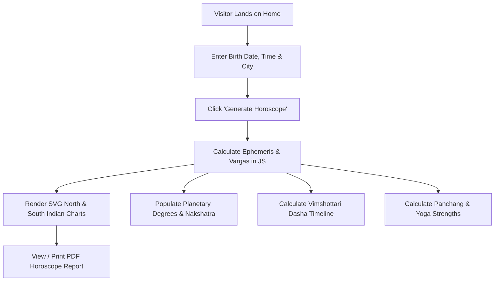

# Document 03 — App Flow (Navigation & User Journey Map)

## App Screen Hierarchy

1. **Home / Hero Landing (`#home`)**
   - Brand headline, feature trust badges, and interactive SVG Kundali preview.
2. **Birth Details Input Form (`#kundali`)**
   - Inputs: Full Name, Date of Birth, Time of Birth, City / Birth Place, Gender, Language.
   - Action: "Generate Horoscope" button triggers the mathematical calculations.
3. **Birth Charts Section (`#charts`)**
   - Toggle view options for North-Indian (Diamond) and South-Indian (Box) charts.
   - Display of D1 (Rashi) and D9 (Navamsha) divisional charts.
4. **Planetary Positions Dashboard (`#planets`)**
   - Grid cards displaying Sign, Degrees, Nakshatra, Pada, and Dignity (Exalted/Own/Debilitated) for 9 planets + Ascendant.
5. **Dasha Timeline (`#predictions`)**
   - Vimshottari Mahadasha chronological progression with active dasha indicator.
6. **Yoga & Ashtakavarga Analysis**
   - Identified Yogas with strength indicators & Sarvashtakavarga score table.
7. **Panchang & Muhurta (`#panchang`)**
   - Daily Tithi, Nakshatra, Yoga, Karana, Vara, and Ayanamsa values.
8. **Kundali Matching (`#compatibility`)**
   - Ashta Kuta 36-guna scoring profile for relationship matching.
9. **Horoscope PDF Export (`#reports`)**
   - Print-friendly layout export.

---

## User Journey Sequence

